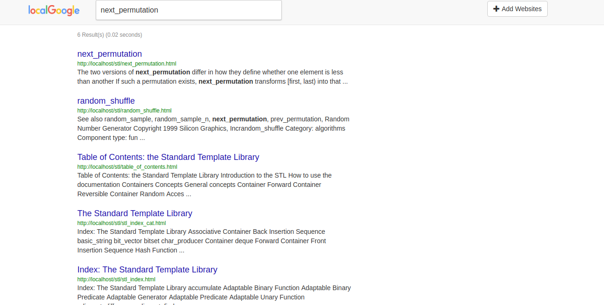
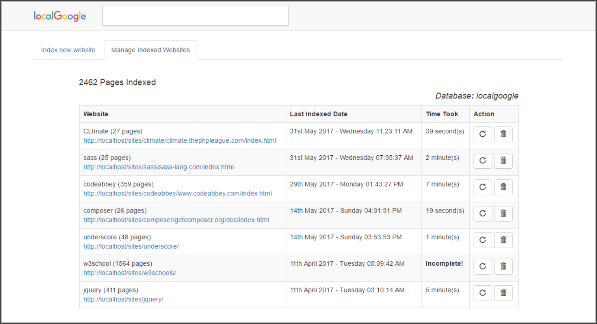
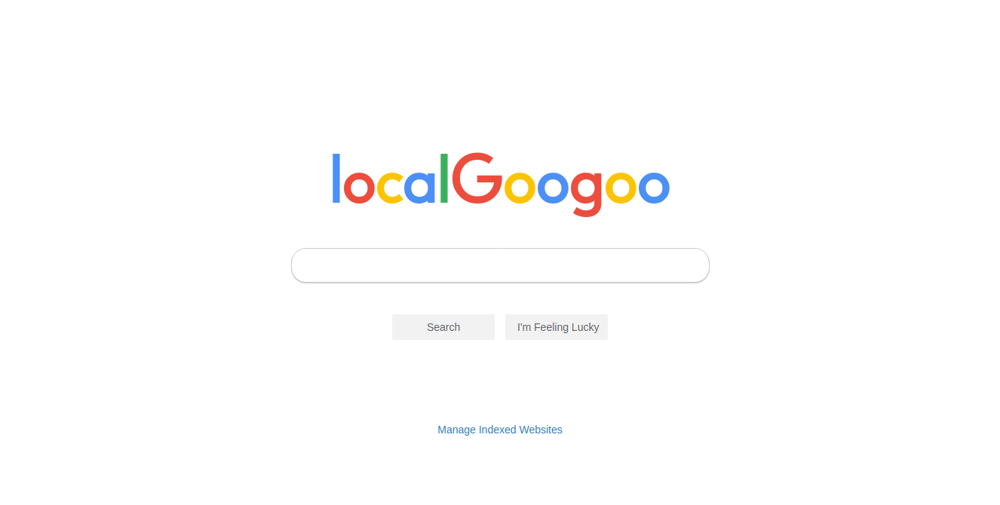

<p align="center">  </p>

[](https://travis-ci.org/kodejuice/localGoogle)
[](https://www.codacy.com/app/kodejuice/localGoogle_2?utm_source=github.com&amp;utm_medium=referral&amp;utm_content=kodejuice/localGoogle&amp;utm_campaign=Badge_Grade)
[](LICENSE.md)


If you have the offline version of websites like ([MDN](https://developer.mozilla.org/), [W3Schools](https://w3schools.com/), [PHP.net](https://php.net/), e.t.c), then this is a must have tool for you.

## What is it

localGoogle is a minimalistic search engine that saves you the stress of manually going through your offline websites looking for information.

With localGoogle you just crawl/index these offline websites and just with a single search query you get the information you need.




## Installation

### Requirements
  * PHP: >= v7.x
  * WebServer: Apache or Nginx
  * Database: MySQL or MariaDB
<br><br>

```bash
$ git clone http://github.com/kodejuice/localgoogle.git
$ cd localgoogle
$ composer install
```
<br>

Make sure the `localgoogle` folder is placed somewhere under your local web document root. Your offline websites should also be under local web directory, localGoogle wont be able to crawl them if they're not accessible via the `http://` protocol.

Configuration
-------------

Next, setup your database information in the `config.json` file found in the root directory

config.json

```json
{
	"DB_HOST": "localhost",

	"DB_USER": "root",

	"DB_PASSWORD": "",

	"DB_NAME": "localgoogle"
}

```

Note: You can also setup your database information by running `./bin/localgoogle config`

_You don't have to manually create the database, localGoogle automatically does that._

After setup, visit (http://localhost/path/to/localgoogle) you should see something like this:



And that's it, you can go to the crawled websites page to crawl/index websites, make your life easier.

**If you're new to the Offline-websites thing, then you should check out [HTTrack](https://www.httrack.com/), a software that allows you to download a World Wide Web site from the Internet to a local directory, building recursively all directories, getting HTML, images, and other files from the server to your computer.**

## License

localGoogle is licensed under the [MIT license](https://opensource.org/licenses/MIT).
